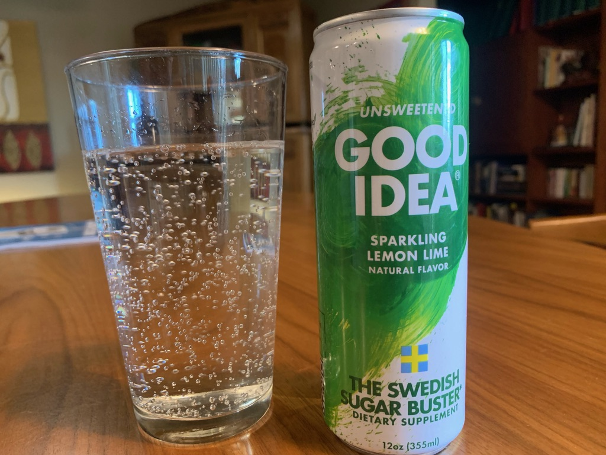
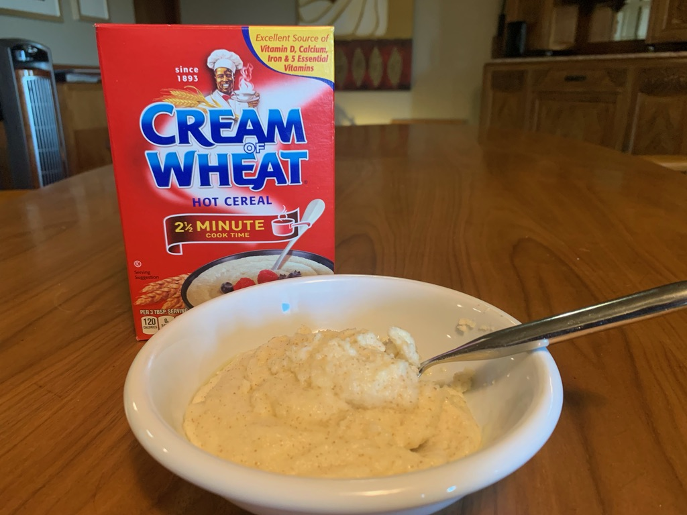

```{r setup, include=FALSE}
knitr::opts_chunk$set(echo = FALSE)
library(psiCGM)
library(tidyverse)
library(lubridate)
library(knitr)
library(kableExtra)
```

```{r setup_more, include = FALSE, echo = FALSE}
library(showtext)
font_add_google("Montserrat")
showtext_auto()

psi_theme <-   theme(text = element_text(# family = "Montserrat",
                                         face = "bold", size = 15),
                     axis.text.x = element_text(size = 15, angle = 90, hjust = 1),
                     legend.title = element_blank())

conn_args <- config::get("dataconnection")
con <- DBI::dbConnect(
  drv = conn_args$driver,
  user = conn_args$user,
  host = conn_args$host,
  port = conn_args$port,
  dbname = conn_args$dbname,
  password = conn_args$password
)


```

```{r readTaster, include = FALSE, echo = FALSE, warning = FALSE}
source("psi_db_taster_notes.R")
# from file.path(config::get("tastermonial")$datadir,"table-data.csv")
# taster_raw <- taster_raw()
#taster_raw %>% names()
```

# Good Idea®

GoodIdea®, "the Swedish sugar buster", is a sparkling soft drink formulated with a proprietary blend of ingredients that claims to lower overall glucose levels when consumed before a meal. How well does it work for me?

{width="600"}

## My Personal Science Experiment

Wearing a continuous glucose monitor (CGM) on three different mornings on an empty stomach, I ate a bowl of Cream of Wheat mixed with 1/4 cup heavy cream and 1 TBS butter. This meal is about 500 calories, including 50g of net carbs and 35g of fat. I wanted a food that is generally considered "healthy", with no sugar content, but high carb. I served it with a generous amount of fat to avoid significant glucose spikes.

I finished within five minutes and then I remained as sedentary as possible for the next two hours.

{width="600"}

On one of those mornings I drank a can of Good Idea® fifteen minutes before the meal. 

```{r calcGlucose_cow, echo = FALSE, include = FALSE}

foodname <- "Cream of Wheat"
# return all users who ate foodname
food_results <- food_times_df(user_id = lookup_id_from_name("Richard Sprague"),
                              prefixLength = 0,
                              timeLength = 150,
                              foodname=foodname) 


food_results %>% group_by(meal) %>% arrange(t) %>% mutate(value = value - first(value)) %>% ungroup() %>% arrange(meal)

new_foodnames <- c("Cream of Wheat (Plain)", "Cream of Wheat (Plain)", "Cream of Wheat (Goodidea)")


food_results[food_results$meal=="RSprague-8/31-Cream of Wheat","meal"] <- "Cream of Wheat (Plain) #1"

food_results[food_results$meal=="RSprague-9/2-Cream of Wheat","meal"] <- "Cream of Wheat (w/GoodIdea)"

food_results[food_results$meal=="RSprague-9/1-Cream of Wheat","meal"] <- "Cream of Wheat (Plain) #2"
food_results

```

```{r plotGlucose, echo = FALSE}


food_results %>% group_by(meal) %>% arrange(t) %>% mutate(value = value - first(value)) %>% ungroup() %>% arrange(meal) %>% #transmute(t,value,meal = paste(foodname,date_ch)) %>%
  ggplot(aes(x=t,y=value, color = meal)) +
      geom_rect(aes(xmin=0,
                xmax=120, #max(Date),
                ymin=-Inf,
                ymax=Inf),
            color = "lightgrey", 
            alpha=0.005) +
geom_line(size = 2) +
  labs(title = sprintf("%s",foodname), subtitle = "August 2021", x = "Minutes") + 
  ylim(-50,100)+
  psi_theme

```

This chart shows an obvious spike soon after plain Cream of Wheat meals, climbing at least 20 points within the first half hour. (Note: the values here are normalized so all meals start at 0).  By contrast, the meal that followed a glass of Good Idea® seemed more stable.

In both of the plain meals, my glucose level was actually *lower* at the end than at the beginning, a "sugar crash" after eating such a high carbohydrate load. Good Idea®, on the other hand, gave no such crash.


```{r auc, fig.cap = "Different meals arranged in order of \"auc\" (area under the curve)."}

food_results %>% distinct() %>%
        group_by(meal, foodname) %>%
        summarize(
                  auc = DescTools::AUC(t,value-first(value)),
                  min = min(value),
                  max = max(value),
                  rise = last(value) - first(value),
                  .groups = 'drop') %>%
  select(-foodname) %>% 
        #summarize(auc = sum((lag(value)-value)*(t-lag(t)), na.rm = TRUE)) %>%
        arrange(auc) %>% kable() %>% kableExtra::kable_styling(bootstrap_options = c("striped", "hover", "condensed"))
```

## Conclusions

With such a small sample, we can't say definitively but the relatively small rise on the Good Idea® day points to *some* effect. 

```{r endall}

DBI::dbDisconnect(con)

```
