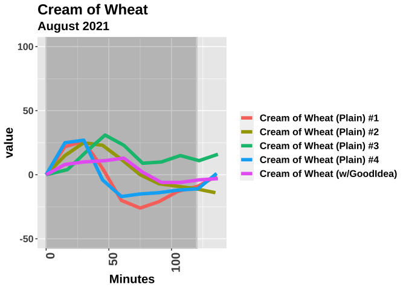

Tastermonial Food Comparisons: Goodidea Drink
================
Richard Sprague
2021-09-03

# Good Idea®

GoodIdea®, “the Swedish sugar buster”, is a sparkling soft drink
formulated with a proprietary blend of ingredients that claims to lower
overall glucose levels when consumed before a meal. How well does it
work for me?

## My Personal Science Experiment

Wearing a continuous glucose monitor (CGM) on three different mornings
on an empty stomach, I ate a bowl of Cream of Wheat mixed with 1/4 cup
heavy cream and 1 TBS butter. This meal is about 500 calories, including
50g of net carbs and 35g of fat. I wanted a food that is generally
considered “healthy”, with no sugar content, but high carb. I served it
with a generous amount of fat to avoid significant glucose spikes.

I finished within five minutes and then I remained as sedentary as
possible for the next two hours.

On one of those mornings I drank a can of Good Idea® fifteen minutes
before the meal.

<!-- -->

This chart shows an obvious spike soon after plain Cream of Wheat meals,
climbing at least 20 points within the first half hour. (Note: the
values here are normalized so all meals start at 0). By contrast, the
meal that followed a glass of Good Idea® seemed more stable.

In both of the plain meals, my glucose level was actually *lower* at the
end than at the beginning, a “sugar crash” after eating such a high
carbohydrate load. Good Idea®, on the other hand, gave no such crash.

<table class="table table-striped table-hover table-condensed" style="margin-left: auto; margin-right: auto;">
<thead>
<tr>
<th style="text-align:left;">
meal
</th>
<th style="text-align:right;">
auc
</th>
<th style="text-align:right;">
min
</th>
<th style="text-align:right;">
max
</th>
<th style="text-align:right;">
rise
</th>
</tr>
</thead>
<tbody>
<tr>
<td style="text-align:left;">
Cream of Wheat (Plain) #1
</td>
<td style="text-align:right;">
-587.0
</td>
<td style="text-align:right;">
73
</td>
<td style="text-align:right;">
125
</td>
<td style="text-align:right;">
-16
</td>
</tr>
<tr>
<td style="text-align:left;">
Cream of Wheat (w/GoodIdea)
</td>
<td style="text-align:right;">
516.5
</td>
<td style="text-align:right;">
83
</td>
<td style="text-align:right;">
108
</td>
<td style="text-align:right;">
19
</td>
</tr>
<tr>
<td style="text-align:left;">
Cream of Wheat (Plain) #2
</td>
<td style="text-align:right;">
540.5
</td>
<td style="text-align:right;">
85
</td>
<td style="text-align:right;">
125
</td>
<td style="text-align:right;">
-15
</td>
</tr>
</tbody>
</table>

## Conclusions

With such a small sample, we can’t say definitively but the relatively
small rise on the Good Idea® day points to *some* effect.
