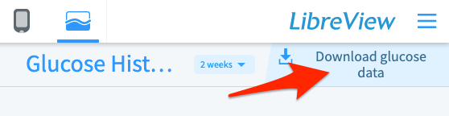

To view your own data you will need:

1.  **Personal Science login account**. Sign up on the Login Tab

2.  **Valid Libreview CSV file**. Get from the <a href="https://www.libreview.com/" target="_blank">Libreview site</a>.

    

3.  **Valid Notes file** that contains information about what foods you ate and what time.

<table class="table table-bordered table-hover table-condensed">
<thead><tr><th title="Field #1">Start</th>
<th title="Field #2">End</th>
<th title="Field #3">Activity</th>
<th title="Field #4">Comment</th>
<th title="Field #5">Z</th>
</tr></thead>
<tbody><tr>
<td>2022-01-01 2:10:00 PM</td>
<td></td>
<td>Food</td>
<td>Clif Bar</td>
<td align="right"></td>
</tr>
<tr>
<td>2022-01-01 10:00:00 PM</td>
<td>2022-01-02 6:30:00 AM</td>
<td>Sleep</td>
<td></td>
<td align="right">8.5</td>
</tr>
</tbody></table>

